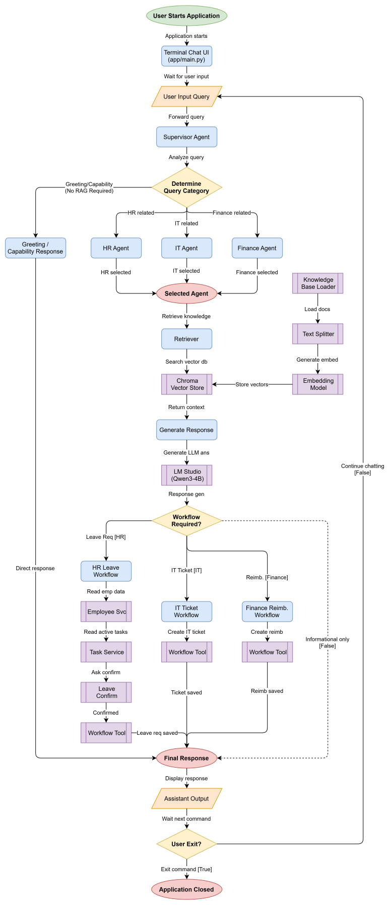

# Enterprise Internal Service Desk

## Project Overview

Enterprise Internal Service Desk is a Multi-Agent LLM system that demonstrates Retrieval-Augmented Generation (RAG) for enterprise internal services. The system routes employee questions to the correct department agent, retrieves relevant information from department-specific SOP documents, and generates grounded answers using a local LLM.

This project was developed as the Final Project for the Enterprise AI course.

## System Architecture

The following diagram illustrates the overall architecture of the Enterprise Service Desk system.



## Enterprise Case Study

Employees often struggle to find internal SOP information because documents are scattered across different departments. This system demonstrates how a Multi-Agent architecture can automatically route requests to the appropriate department and answer using department-specific knowledge.

The system supports three departments:
- HR
- IT
- Finance

Each department has its own knowledge base, vector store, and agent.

## Architecture

```
User Query
    |
    v
Supervisor Agent (keyword routing)
    |
    v
Department Agent (HR / IT / Finance)
    |
    v
RAG Pipeline
    |
    v
Chroma Vector Store
    |
    v
LLM (LM Studio)
    |
    v
Final Response
```

## Project Structure

```
app/
    main.py                  Entry point
    config.py                Configuration
    llm.py                   LLM initialization (LM Studio)
    agents/
        __init__.py
        supervisor.py         Keyword-based routing
        hr_agent.py           HR agent with leave workflow
        it_agent.py           IT agent
        finance_agent.py      Finance agent
    rag/
        __init__.py
        loader.py             Markdown document loader
        splitter.py           Text chunking
        embeddings.py         Embedding model initialization
        vectordb.py           Chroma vector store creation
        retriever.py          Similarity retriever
    tools/
        retrieve_tool.py      Context retrieval
        validation_tool.py    Context validation
        response_tool.py      LLM response generation
        workflow_tool.py      Leave, IT ticket, reimbursement workflows
        task_lookup_tool.py   Employee task lookup
    utils/
        __init__.py
enterprise_data/
    employees.json
    tasks.json
    leave_requests.json
    it_tickets.json
    reimbursements.json
knowledge_base/
    hr/     HR SOP documents
    it/     IT SOP documents
    finance/  Finance SOP documents
tests/
    test_loader.py
    test_splitter.py
    test_vectordb.py
    test_retriever.py
    test_retrieve_tool.py
    test_validation_tool.py
    test_response_tool.py
    test_hr_agent.py
    test_it_agent.py
    test_finance_agent.py
    test_supervisor.py
    test_hr_workflow.py
    test_hr_task_workflow.py
    test_leave_recommendation.py
    test_leave_confirmation.py
    test_it_ticket_workflow.py
    test_reimbursement_workflow.py
    test_task_lookup_tool.py
    test_workflow_tool.py
    test_grounded_response.py
    test_concise_response.py
    demo_system.py
evaluation/
    evaluate_accuracy.py
    evaluate_efficiency.py
    evaluate_hallucination.py
    report.md
docs/
    PROJECT_RULES.md
    PROMPT_RULES.md
    ROADMAP.md
    architecture.drawio.png
```

## Technologies Used

- Python 3.11
- LangChain
- ChromaDB
- Sentence Transformers (all-MiniLM-L6-v2)
- LM Studio (OpenAI Compatible API)
- PyPDF

## Multi-Agent Workflow

1. User submits a question.
2. Supervisor Agent uses keyword matching to determine the target department.
3. The selected Department Agent retrieves context from its own vector store.
4. The agent validates whether relevant context was found.
5. The LLM generates a grounded answer using only the retrieved context.
6. The response is returned to the user.

### Routing Keywords

- HR: cuti, izin, lembur, bpjs
- IT: password, vpn, email, laptop
- Finance: reimbursement, invoice, pembayaran, pembelian

If no keywords match, the system returns: "I cannot determine which department should answer your request."

## RAG Pipeline

1. Loader: Reads Markdown files from `knowledge_base/` and assigns department metadata based on folder names.
2. Splitter: Chunks documents using `RecursiveCharacterTextSplitter` (chunk_size=500, chunk_overlap=50).
3. Embeddings: Generates vectors using `sentence-transformers/all-MiniLM-L6-v2`.
4. Vector Store: Persists embeddings to ChromaDB at `knowledge_base/vector_store/`.
5. Retriever: Returns top-3 similar chunks using similarity search.
6. Response: LLM generates a concise answer grounded in the retrieved context.

### Response Constraints

The system prompt enforces:
- Answer only using the provided context.
- No assumptions or invented procedures.
- At most 3 bullet points.
- Maximum 80 words.
- Use Indonesian.
- If no answer is found, reply: "I don't have enough information from the knowledge base."

## Enterprise Workflows

### Leave Request

When the HR agent detects a leave request (contains "cuti" but not "bagaimana"), it:

1. Retrieves HR context and generates an LLM answer.
2. Looks up active tasks for the employee.
3. If active tasks exist, recommends task handover before leave.
4. If no active tasks, confirms leave can proceed normally.
5. Creates a leave request record in `enterprise_data/leave_requests.json`.
6. Returns the LLM answer with task recommendation and leave confirmation.

### IT Ticket

The IT agent answers IT-related queries using the IT knowledge base. IT ticket creation is available through `create_it_ticket()` in the workflow tool.

### Reimbursement

The Finance agent answers finance-related queries using the Finance knowledge base. Reimbursement creation is available through `create_reimbursement()` in the workflow tool.

## Evaluation

The project includes evaluation scripts for:
- Accuracy
- Efficiency
- Hallucination

Results are documented in `evaluation/report.md`.

## Installation

1. Clone the repository.
2. Create a Conda environment:

```
conda env create -f environment.yml
conda activate enterprise-service-desk
```

3. Install dependencies:

```
pip install -r requirements.txt
```

4. Start LM Studio and load a model. Ensure the API server is running at `http://localhost:1234/v1`.

## How to Run

### 1. Run Interactive CLI

```bash
python -m app.main
```

This starts the Enterprise Service Desk terminal chat. Type questions directly and receive answers from the appropriate department agent. Type `exit` to quit.

### 2. Run Demo

```bash
python -m tests.demo_system
```

This runs predefined HR, IT and Finance queries through the Supervisor Agent and prints the responses.

### 3. Run Evaluation

```bash
python evaluation/evaluate_accuracy.py
python evaluation/evaluate_efficiency.py
python evaluation/evaluate_hallucination.py
```

These scripts evaluate the implemented RAG system for accuracy, efficiency, and hallucination metrics.

### 4. Run Workflow Tests

```bash
python -m tests.test_leave_confirmation_flow
python -m tests.test_bilingual_routing
python -m tests.test_clean_output
```

These are manual smoke tests that verify specific workflows and output formatting.

## Demo

The demo script (`tests/demo_system.py`) runs three queries:

1. "Bagaimana cara mengajukan cuti?" -> HR Agent
2. "Bagaimana cara reset password?" -> IT Agent
3. "Bagaimana cara reimbursement?" -> Finance Agent

Each query is routed by the Supervisor Agent, processed by the appropriate department agent, and answered using the RAG pipeline.

## Repository Structure

- `app/` -- Core application code including agents, RAG pipeline, and tools.
- `enterprise_data/` -- JSON data files for employee records, tasks, leave requests, IT tickets, and reimbursements.
- `knowledge_base/` -- Department-specific SOP documents organized by folder (hr, it, finance).
- `evaluation/` -- Evaluation scripts and report for measuring system performance.
- `tests/` -- Manual smoke tests and the end-to-end demo script.
- `assets/images/` -- Architecture diagram and other image assets for documentation.

## Future Improvements

- Semantic routing for better query classification.
- Agent memory for multi-turn conversations.
- Web user interface.
- REST API.
- Graph RAG for cross-department knowledge.
- Additional department support.

## Project Status

- ✅ Multi-Agent Routing
- ✅ Retrieval-Augmented Generation (RAG)
- ✅ Chroma Vector Database
- ✅ Embedding Pipeline
- ✅ Department Agents
- ✅ Enterprise Workflows
- ✅ Evaluation Scripts
- ✅ Interactive CLI
- ✅ Bilingual Support
- ✅ Documentation